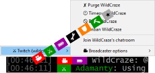

# TMI 4 mIRC
## Twitch fixes and enhancements for mIRC. 

### v1.2

* Downloads and display channel logo in the corner

### v1.1

* Uses nick prefixes ~&@%+ to group user types.
* Sets a topic with current status and category

### v1.0

* Takes care of enabling joins and parts in a channel
* Displays additional /CAP information in a friendly manner
* Optional text layout using badge imitations and approximated nick colors.
* Context menu with basic features.
